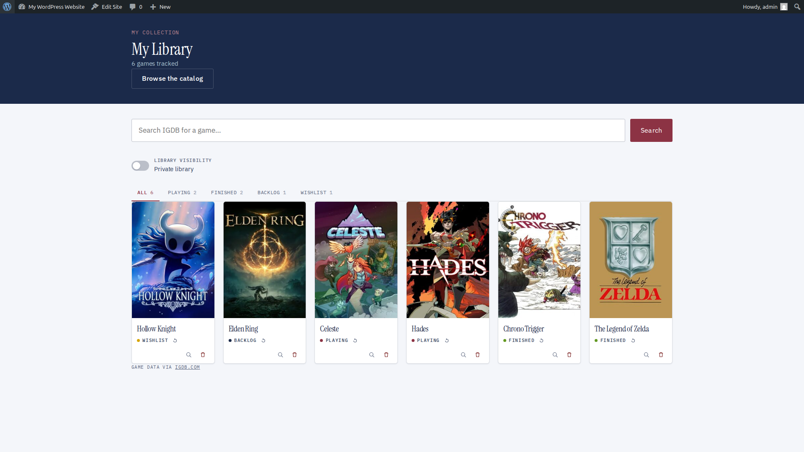

# Game Library

> An invite-only, IGDB-backed game-tracking community — invite links, a personal
> library at four statuses, follows, an activity feed, and a member directory.

A self-contained WordPress plugin. **Requires** WordPress 6.4+ and PHP 7.4+.
Licensed **GPL-2.0-or-later**.

---

## About this repository

This plugin was built end-to-end by an agentic development pipeline — spec,
research, architecture, code, a four-reviewer loop, and demo — and written up
here:

**📝 [Starter pipeline, with a design brief](https://principalwp.com/2026/08/15/starter-pipeline-with-design-brief/)**

> **You are viewing the `starter-designed` branch** — the output of the
> **Principal WP starter pipeline**, run with a design brief so the build ships
> a designed front end (token-driven CSS and self-hosted type) rather than
> default styling.

The repository also carries the **full-pipeline** build of the same plugin idea
on the [`full-designed`](../../tree/full-designed) and
[`full-initial`](../../tree/full-initial) branches — a separate, heavier pipeline
run. This branch is a leaner, faster pipeline; the plugin here is its own
codebase, not a restyle of the full build.

---

## Demo

A ~38-second silent walkthrough, recorded against
[WordPress Playground](https://wordpress.github.io/wordpress-playground/) with a
**mocked** IGDB API, so it runs with no credentials:

**▶ [`game-library-demo.webm`](game-library-demo.webm)**

What it covers: the cover-forward library at `/my-library/`, debounced IGDB
search with one-click add at a chosen status, inline status changes, the
public/private visibility toggle, the member directory with one-directional
follows, the *Following / Everyone* activity feed, single-use invite links, and
the shared game catalog with per-game holder lists.

> _The demo was recorded before release-date metadata was wired in, so a game
> detail hero may read "UNRELEASED"; the shipped plugin renders the real year._

---

## What it does

- **Invite-only membership** — each member holds a monthly quota of single-use
  invite links (30-day expiry); invited people register through a gated Join
  page. No open sign-up.
- **IGDB-backed search** — a debounced search box hits the IGDB catalog and adds
  a game to your personal library in one click, no page reload.
- **Four curation statuses** — Playing, Finished, Backlog, and Wishlist, as
  filterable tabs plus a click-to-edit badge on every card that swaps status
  inline.
- **A cover-forward library** at `/my-library/` — real IGDB box art in a
  responsive grid, with per-status counts and a public/private visibility
  toggle.
- **Members directory, following, and a privacy-aware activity feed** —
  one-directional follows and a *Following / Everyone* stream where a private
  member's activity never leaks into the sitewide feed.
- **A shared game catalog** at `/games/` — every game anyone has added, each
  with a detail page listing who holds it and at what status.

### Eight front-end routes

`/my-library/` · `/library/{member}/` · `/activity/` · `/members/` ·
`/invites/` · `/join/{code}/` · `/games/` · `/games/{slug}/`

Each is a plugin-owned document rendered by **template takeover** — the plugin
serves the whole page, so it drops into any theme.

---

## Installation

1. Copy this branch into `wp-content/plugins/game-library-3/` (or download the
   ZIP and unzip it there).
2. Activate **Game Library** in the WordPress admin. Make sure pretty permalinks
   are enabled (Settings → Permalinks, anything other than "Plain").
3. Under **Settings → Game Library**, add your IGDB (Twitch) **Client ID** and
   **Client Secret** — or define `GL_IGDB_CLIENT_ID` and `GL_IGDB_CLIENT_SECRET`
   in `wp-config.php` (constants take precedence and make the fields read-only).
   A secret entered through the settings screen is encrypted at rest with
   `sodium_crypto_secretbox`. Credentials are stored server-side and never
   exposed to the front end.

---

## IGDB attribution

Game metadata is provided by [IGDB.com](https://www.igdb.com/). A real install
needs your own IGDB (Twitch) client ID and secret; the demo above mocks the IGDB
API so it works with none.

## License

Plugin code: **GPL-2.0-or-later**.
