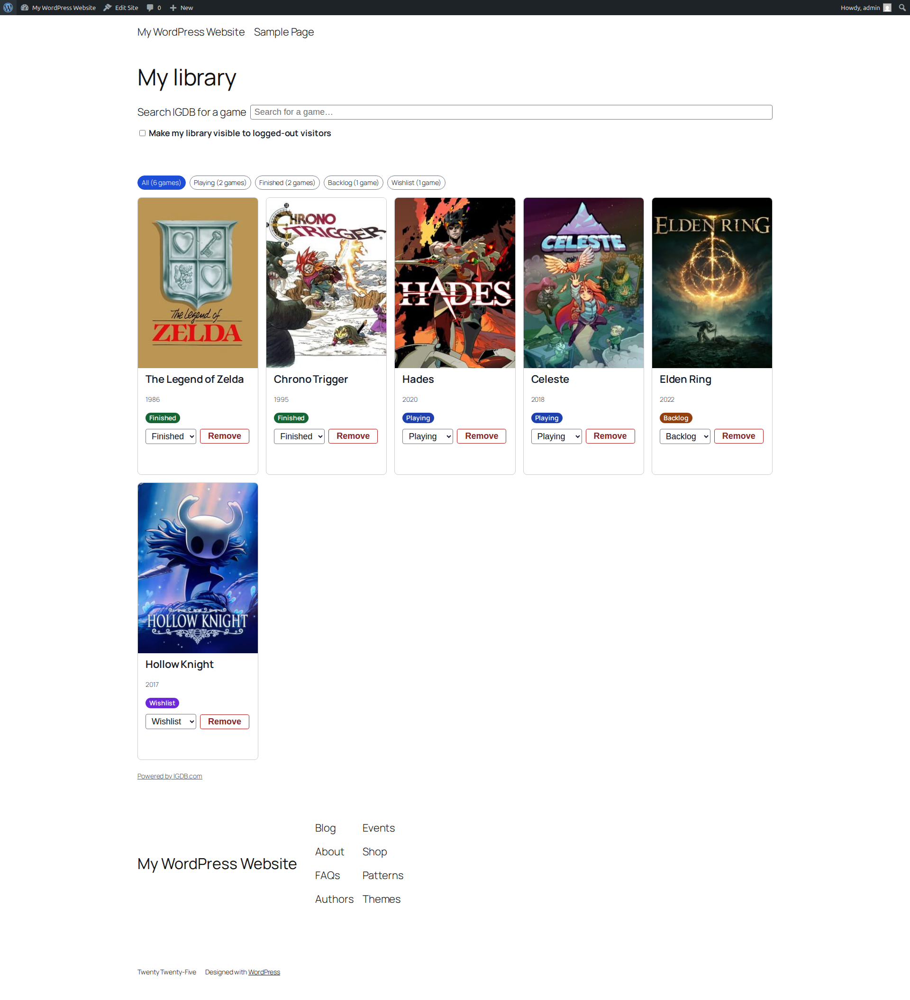

# Game Library

> An invite-only community platform where members build and share personal
> video-game libraries backed by the [IGDB](https://www.igdb.com/) catalog —
> search, curate, follow, and browse.

A self-contained WordPress plugin. **Requires** WordPress 6.4+ and PHP 8.4+.
Licensed **GPL-2.0-or-later**.

---

## About this repository

This plugin was built end-to-end by an agentic development pipeline — spec,
research, architecture, code, review, and demo — and written up here:

**📝 [Full pipeline: Game Library — the designed version](https://principalwp.com/2026/08/16/full-pipeline-game-library-demo-designed/)**

The repo carries two branches that are **functionally identical** and differ
**only in visual design**:

| Branch | What it is |
|--------|------------|
| [`full-initial`](../../tree/full-initial) | The pipeline's first-pass output — full functionality, the original design. Game details open as a full page. |
| [`full-designed`](../../tree/full-designed) | The same plugin after a dedicated design pass — a PrincipalWP-voice restyle, navy site chrome, bundled type (IBM Plex / Instrument Serif), and an in-page **quick-look** panel for game details. |

Every bug fix and functional behaviour is shared by both branches; the design
pass changed presentation only.

> **You are viewing the `full-designed` branch.**

---

## Demo

A ~5.5-minute narrated walkthrough, recorded against
[WordPress Playground](https://wordpress.github.io/wordpress-playground/) with a
live IGDB search proxy (credentials stay server-side and never reach the
browser):

**▶ [`game-library-demo.webm`](game-library-demo.webm)**

What it covers:

- **Admin setup & IGDB** — credentials read "Configured" (the secret is never
  rendered), Test-connection succeeds, cached admin counters.
- **Invites** — per-member quotas, invite creation with code / redemption URL /
  copy control, resilience to mail failure, quota-exhaustion messaging, and the
  admin Invites list with status filters and Resend / Revoke row actions.
- **Registration** — the pre-submit visibility notice; invalid / expired /
  revoked / already-registered handling; accessible inline validation; a valid
  submission creates exactly one Subscriber and lands on `/my-library/`.
- **Search & library** — idle, loading, results, empty and unavailable states;
  add-to-library with a per-game status; status changes; cover placeholders;
  entry removal; the public/private profile toggle.
- **Members, following & activity** — the member directory, one-directional
  follow, the activity feed, a read-only public library, and pagination at 24
  entries per page.
- **Public game pages & SEO** — the public catalog and game pages with
  per-status holder counts, one `VideoGame` JSON-LD object, a self-referencing
  canonical, the "Powered by IGDB" attribution link, `noindex` on private
  routes, sitemap integration, and a 404 once a game loses its last holder.
- **Moderation & refresh** — moderator edits with cache invalidation on save,
  IGDB refresh with a one-hour throttle, single activity-entry deletion, and the
  capability walls (HTTP 403) that protect every moderation write.
- **Auth & graceful degradation** — private routes redirect anonymous visitors
  to log in (REST returns 401), Subscribers are kept out of `wp-admin`, and when
  IGDB is unavailable every cached surface still serves 200 while only search and
  add-new degrade.

---

## What it does

- **Invite-only membership** with per-member invite quotas, expiry, and
  revocation, plus admin management (list table, filters, resend/revoke).
- **IGDB-backed search** — search the IGDB catalog and add games to a personal
  library, each with a curation status.
- **Personal libraries** with per-game status, cover art (and text placeholders
  when none exists), a public/private visibility toggle, and pagination.
- **Members directory, following, and an activity feed** — one-directional
  follows and a per-follower activity stream.
- **Public game pages** with structured data (`VideoGame` JSON-LD), canonical
  URLs, sitemap integration, and IGDB attribution.
- **Moderation tools** for editing cached game metadata, refreshing from IGDB,
  and pruning activity — all capability-gated.

---

## Installation

1. Copy this branch into `wp-content/plugins/game-library/` (or download the ZIP
   and unzip it there).
2. Activate **Game Library** in the WordPress admin.
3. Under the plugin settings, add your IGDB (Twitch) **Client ID** and **Client
   Secret**. Credentials are stored server-side and never exposed to the front
   end.

---

## IGDB attribution

Game metadata is provided by [IGDB.com](https://www.igdb.com/). Public game
pages carry a "Powered by IGDB" attribution linking back to each game's own IGDB
page, per the IGDB terms of use.

## License

- Plugin code: **GPL-2.0-or-later**.
- Bundled fonts — IBM Plex and Instrument Serif — under the **SIL Open Font
  License 1.1** (see `assets/fonts/*OFL.txt`).
